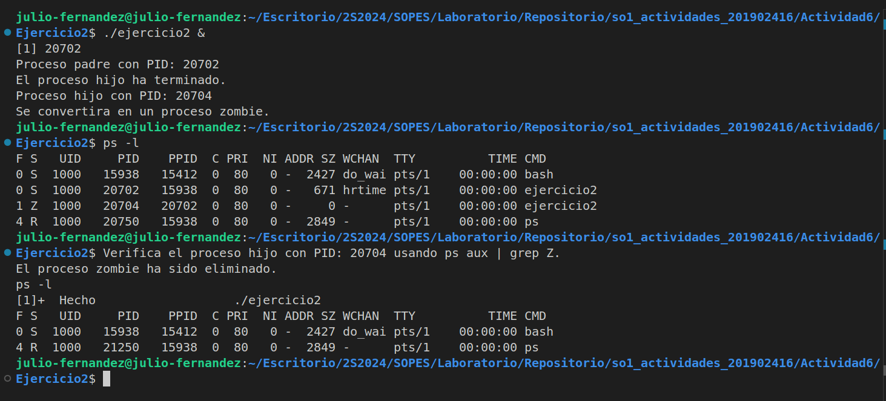

Universidad de San Carlos de Guatemala <br>
Facultad de Ingeniería <br>
Escuela de Ciencias y Sistemas <br>
Sistemas Operativos 1 <br>


# <div align="center"> &nbsp; Ejercicio#1 &nbsp; 

¿Incluyendo el proceso inicial, cuantos procesos son creados por el siguiente programa?

Razone su respuesta. 

```C
#include <stdio.h> 
#include <unistd.h> 

int main() { 
    /* fork a child process */ 
    fork(); /* fork another child process */ 
    fork();

    /* and fork another */ 
    fork(); 
    return 0; 
}
```

### Conclusion
<p style='text-align:justify'>
El programa comienza con un solo proceso, el proceso inicial. Cada vez que se llama a fork(), el proceso en ejecución se duplica, creando un nuevo proceso hijo. En la primera llamada a fork(), se crea un proceso hijo, resultando en 2 procesos en total. Luego, en la segunda llamada, ambos procesos (el padre y el hijo) ejecutan fork(), lo que duplica el número de procesos, alcanzando 4 procesos en total. Finalmente, en la tercera llamada a fork(), los 4 procesos existentes se duplican nuevamente, generando 4 procesos adicionales, para un total de 8 procesos. Por lo tanto, el programa crea 7 nuevos procesos, sumados al proceso inicial, lo que da un total de 8 procesos.
</p>

# <div align="center"> &nbsp; Ejercicio#2 &nbsp; 

<p style='text-align:justify'>
Utilizando un sistema Linux, escriba un programa en C que cree un proceso hijo (fork)
que finalmente se convierta en un proceso zombie. Este proceso zombie debe
permanecer en el sistema durante al menos 60 segundos.
Los estados del proceso se pueden obtener del comando: ps -l.
</p>

### Solucion
<details>
<summary>Codigo</summary>
    Para poder ejecutar este codigo irse a la carpeta Ejercicio2 y ejecutar el comando make, donde se creara un ejecutable llamado ejercicio2, luego ejecutar este mismo con ./ejercicio2.
    

        #include <stdio.h>
        #include <stdlib.h>
        #include <sys/types.h>
        #include <sys/wait.h>
        #include <unistd.h>

        int main() {
            pid_t pid;

            // Crear un proceso hijo
            pid = fork();

            if (pid < 0) {
                // Error al crear el proceso hijo
                perror("fork failed");
                exit(1);
            } else if (pid == 0) {
                // Proceso hijo
                printf("Proceso hijo con PID: %d\n", getpid());
                printf("Se convertira en un proceso zombie.\n");
                exit(0); // El proceso hijo termina, se convierte en zombie
            } else {
                // Proceso padre
                printf("Proceso padre con PID: %d\n", getpid());
                printf("El proceso hijo ha terminado.\n");

                // Esperar más tiempo antes de hacer wait()
                sleep(60); 

                // Usa el comando `ps` o verifica el PID manualmente para ver el estado zombie
                printf("Verifique el proceso hijo con PID: %d usando ps -l.\n", pid);

                // Ahora hacemos wait() para eliminar el proceso zombie
                wait(NULL);
                printf("El proceso zombie ha sido eliminado.\n");
            }

            return 0;
        }
        

</details>

<details>
<summary>Captura de la terminal</summary>
        <div align="center">
                        <a href="" target="_blank"></a>
        </div>

</details>

# <div align="center"> &nbsp; Ejercicio#3 &nbsp; 

Usando el siguiente código como referencia, completar el programa para que sea

ejecutable y responder las siguientes preguntas:

- ¿Cuántos procesos únicos son creados?

- ¿Cuántos hilos únicos son creados?

```C
pid.t pid;

pid = fork()
if (pid == 0 ) {
    fork();
    thread_create( . . . );
}
fork();
```
### Solucion

### - Codigo completo

```c
    #include <stdio.h>
    #include <unistd.h>
    #include <pthread.h>
    #include <stdlib.h>

    void* thread_function(void* arg) {
        printf("Soy un hilo en el proceso con PID: %d\n", getpid());
        return NULL;
    }

    int main() {
        pthread_t thread;
        pid_t pid;

        // Crear un nuevo proceso
        pid = fork();

        if (pid < 0) {
            perror("Error al crear el proceso");
            exit(1);
        } else if (pid == 0) {
            // Proceso hijo
            printf("Soy el proceso hijo con PID: %d\n", getpid());

            // Crear un hilo dentro del proceso hijo
            pthread_create(&thread, NULL, thread_function, NULL);
            pthread_join(thread, NULL);
        } else {
            // Proceso padre
            printf("Soy el proceso padre con PID: %d\n", getpid());

            // Crear un hilo dentro del proceso padre
            pthread_create(&thread, NULL, thread_function, NULL);
            pthread_join(thread, NULL);

            // Esperar al proceso hijo
            wait(NULL);
        }

        return 0;
    }

```


### - ¿Cuántos procesos únicos son creados?

<p style='text-align:justify'>

Se crean 2 hilos únicos. Esto se debe a que la función ```pthread_create()``` se invoca una vez en el proceso padre y otra vez en el proceso hijo. Cada llamada a ```pthread_create()``` genera un nuevo hilo en el contexto del proceso que la ejecuta. Así, el proceso padre y el proceso hijo, que son independientes, crean un hilo cada uno, resultando en un total de 2 hilos únicos, uno en cada proceso. Los hilos se ejecutan en paralelo con el hilo principal de cada proceso, pero no se mezclan entre los procesos.
</p>