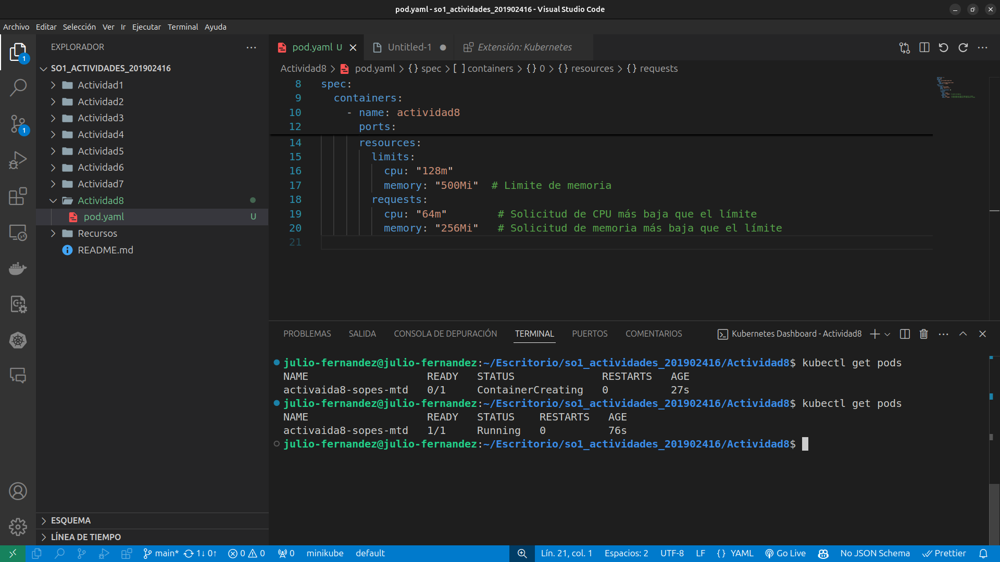
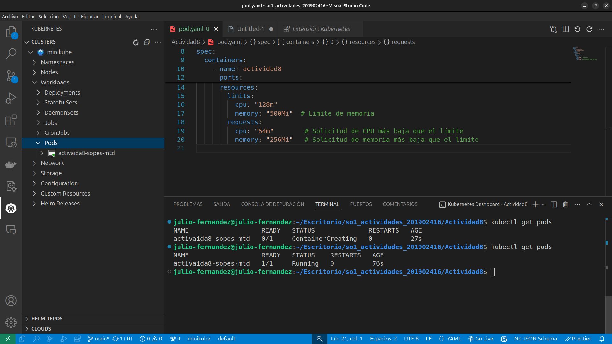
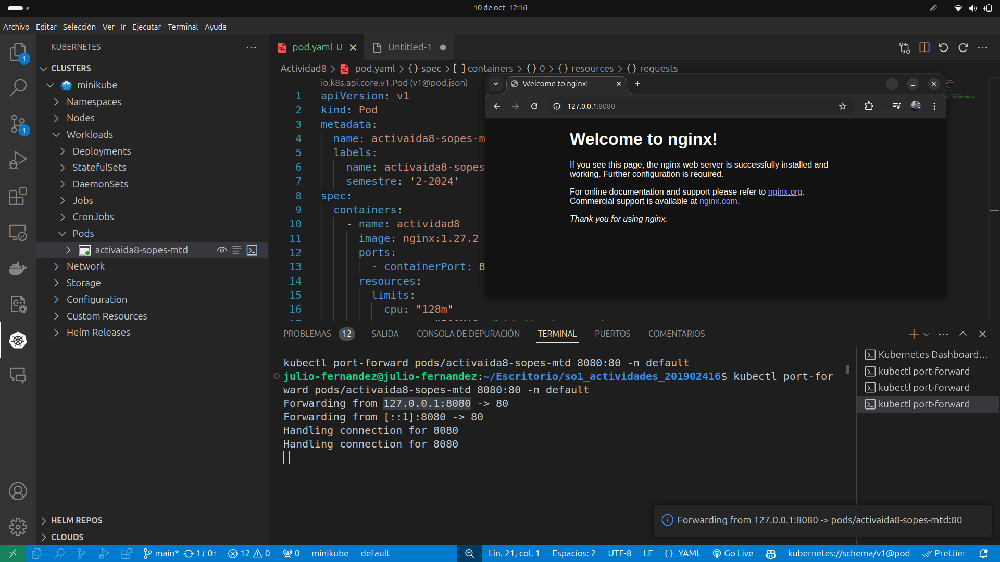
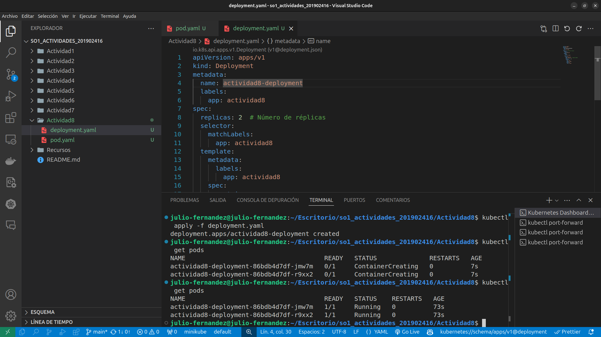
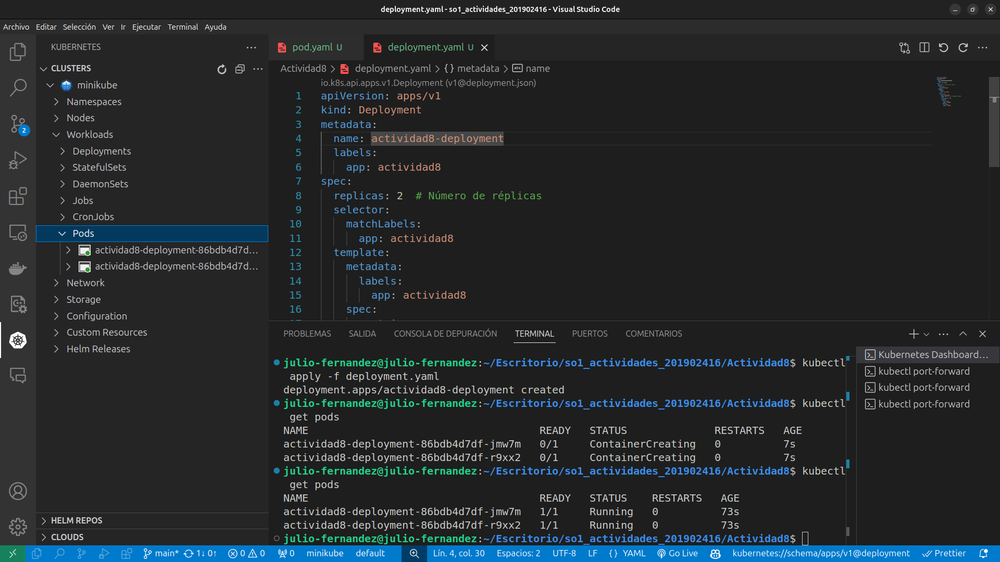
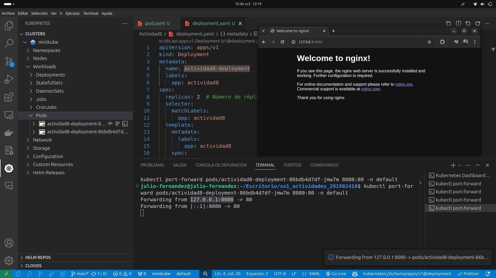
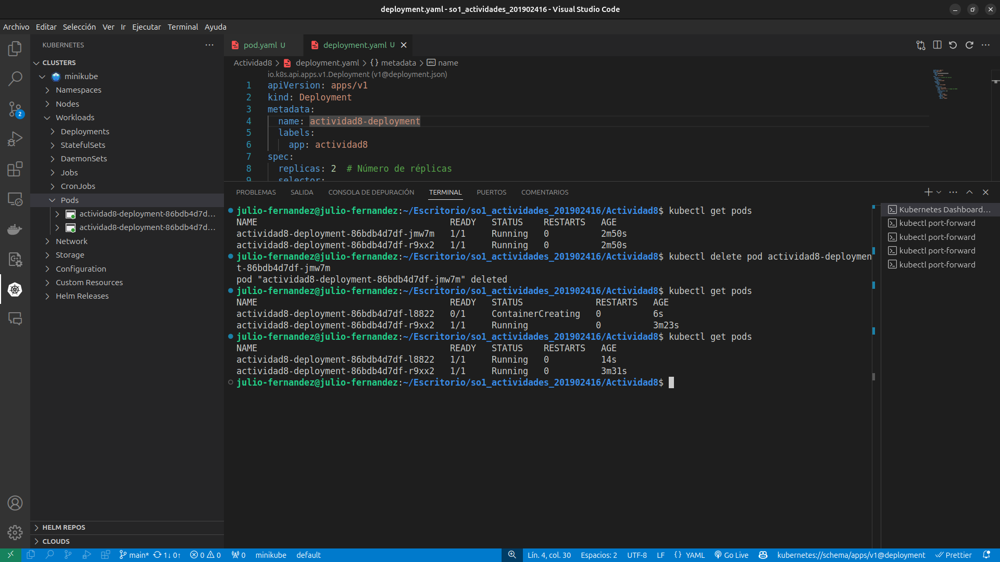

<div style="text-align: center;">
    <span style="font-size: 18px;">Universidad de San Carlos de Guatemala</span><br>
    <span style="font-size: 18px;">Facultad de Ingeniería</span><br>
    <span style="font-size: 18px;">Escuela de Ciencias y Sistemas</span><br>
    <span style="font-size: 18px;">Laboratorio de Sistemas de Bases de Datos 1 Sección B</span><br>
    <span style="font-size: 18px;">Julio Alfredo Fernández Rodríguez 201902416</span><BR>
    <span style="font-size: 18px;">Actividad 8</span><BR>

</div>

<br>


# Realizar lo siguiente:

### Instalar un ambiente local de Kubernetes utlizando minikube, kind o Docker Desktop.


### Instalación de Minikube y kubectl en Ubuntu

1. **Instalar `kubectl`**:

   Abre tu terminal y ejecuta los siguientes comandos:

   ```bash
   sudo apt update
   sudo apt install -y apt-transport-https ca-certificates curl
   ```

   Luego, descarga `kubectl`:

   ```bash
   curl -LO "https://storage.googleapis.com/kubernetes-release/release/$(curl -s https://storage.googleapis.com/kubernetes-release/release/stable.txt)/bin/linux/amd64/kubectl"
   chmod +x kubectl
   sudo mv kubectl /usr/local/bin/
   ```

   Verifica que `kubectl` esté instalado:

   ```bash
   kubectl version --client
   ```

2. **Descargar e instalar Minikube**:

   Ejecuta los siguientes comandos para descargar e instalar Minikube:

   ```bash
   curl -LO https://storage.googleapis.com/minikube/releases/latest/minikube-linux-amd64
   sudo install minikube-linux-amd64 /usr/local/bin/minikube
   ```

3. **Iniciar Minikube**:

   Simplemente ejecuta:

   ```bash
   minikube start
   ```

4. **Verificar la instalación**:

   Comprueba que Minikube esté funcionando:

   ```bash
   minikube status
   ```

### Resumen

Con estos pasos, tendrás Minikube y `kubectl` instalados y podrás iniciar Minikube con el comando `minikube start` sin problemas adicionales.


# Desplegar un contenedor de algun web server, apache o nginx por ejemplo, en el Cluster de K8s Local.
En este caso usaremos kubectl como linea de comandos para nuestro cluster de kubernetes que creo minikube 

### Comprueba que Minikube esté funcionando:

   ```bash
   minikube status
   ```
## Creacion del yaml para el pod

```yaml
   apiVersion: v1
    kind: Pod
    metadata:
    name: activaida8-sopes-mtd
    labels:
        name: activaida8-sopes-label
        semestre: '2-2024'
    spec:
    containers:
        - name: actividad8
        image: nginx:1.27.2
        ports:
            - containerPort: 80
        resources:
            limits:
            cpu: "128m"
            memory: "500Mi"  # Limite de memoria
            requests:
            cpu: "64m"        # Solicitud de CPU más baja que el límite
            memory: "256Mi"   # Solicitud de memoria más baja que el límite
   ```
   Para aplicar el pod.yaml ejecutar el comando ```kubectl apply -f name-archivo.yaml```

<details>
<summary>Captura de la creacion del pod</summary>
        <div align="center">
                        <a href="" target="_blank"></a>
        </div>
</details>

<details>
<summary>Captura de la creacion del pod con el administrador de kubernetes</summary>
        <div align="center">
                        <a href="" target="_blank"></a>
        </div>
</details>

<details>
<summary>Captura de la creacion del pod ejecutandose</summary>
        <div align="center">
                        <a href="" target="_blank"></a>
        </div>
</details>


### Verificamos el status de minikube


## Creacion del yaml para creacion de pods con deployment

```yaml
    apiVersion: apps/v1
    kind: Deployment
    metadata:
    name: actividad8-deployment
    labels:
        app: actividad8
    spec:
    replicas: 2  # Número de réplicas
    selector:
        matchLabels:
        app: actividad8
    template:
        metadata:
        labels:
            app: actividad8
        spec:
        containers:
        - name: actividad8
            image: nginx:1.27.2  # Imagen de NGINX
            ports:
            - containerPort: 80
            resources:
            limits:
                cpu: "128m"
                memory: "500Mi"
            requests:
                cpu: "64m"
                memory: "256Mi"
   ```
   Para aplicar el pod.yaml ejecutar el comando ```kubectl apply -f name-archivo.yaml```

<details>
<summary>Captura de la creacion de los pods</summary>
        <div align="center">
                        <a href="" target="_blank"></a>
        </div>
</details>

<details>
<summary>Captura de la creacion de los pods con el administrador de kubernetes</summary>
        <div align="center">
                        <a href="" target="_blank"></a>
        </div>
</details>

<details>
<summary>Captura de la creacion de un pod ejecutandose</summary>
        <div align="center">
                        <a href="" target="_blank"></a>
        </div>
</details>


<details>
<summary>Captura del funcionamiento del autoescalado de kubernetes (reinicio de pod)</summary>
        <div align="center">
                        <a href="" target="_blank"></a>
        </div>
</details>


# Contestar a siguiente pregunta.¿En un ambiente local de Kubernetes existen los nodos masters y workers, como es que esto funciona?
<p style='text-align:justify'>
No, en un entorno local de Kubernetes, como el que se crea con Minikube, la computadora actúa como el nodo master, es decir, el que contiene el control plane, y también como los nodos worker. Esto significa que todos los componentes de Kubernetes, como el servidor API, el controlador y el scheduler, se ejecutan en la misma máquina que los pods y los nodos worker. A diferencia de un clúster de producción, donde el control plane y los nodos worker suelen estar distribuidos en varias máquinas para mejorar la disponibilidad y la escalabilidad, en un entorno local, todo se concentra en una sola máquina para facilitar el desarrollo y las pruebas.
</p>